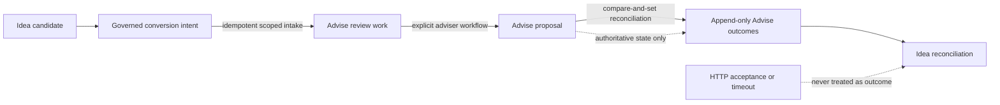

# Idea Conversion Realization In Advise

## Audience

This document is for advisory product owners, application engineers, API consumers, operators,
risk and control reviewers, and implementation teams integrating Lotus Idea with Lotus Advise.

## Business Outcome

An adviser-approved Idea conversion can now be followed from its source candidate to durable
Advise review work, an actual Advise proposal, and a bounded Advise-owned terminal outcome. The
chain remains traceable without transferring suitability, approval, execution, or publication
authority to Idea.

## API Sequence

1. `POST /advisory/proposals/idea-intake` accepts the source-safe Idea conversion intent and creates
   one deterministic `PENDING_ADVISER_REVIEW` work item when review is supported.
2. The adviser workflow creates a proposal through the existing Advise proposal lifecycle. The
   intake route does not auto-create a draft.
3. `POST /advisory/proposals/idea-intake/{intake_id}/realization/proposal-reconciliation` links that
   existing proposal after exact tenant, legal-entity, portfolio, capability, and proposal scope
   checks.
4. `GET /advisory/proposals/idea-intake/{intake_id}/realization` returns the aggregate and its
   ordered source-event history for downstream reconciliation.
5. If the POST response is lost after the Advise commit, `GET
   /advisory/proposals/idea-intake/realization?conversion_intent_id={conversion_intent_id}`
   recovers the same aggregate from the Idea-owned conversion identity and exact trusted scope.
   Recovery is read-only and never resubmits the intake or infers acceptance from a timeout.
   Intake rejects conversion-intent identities that are not URL-safe path segments, so every
   committed identity remains addressable by this recovery contract.

## Outcome Vocabulary

| Authoritative Advise evidence | Realization outcome | Terminal | Meaning |
| --- | --- | --- | --- |
| Accepted Idea review intake | `ACCEPTED_FOR_REVIEW` | No | Advise created durable adviser-review work. |
| Existing same-portfolio proposal linked | `PROPOSAL_LINKED` | No | A concrete Advise proposal now belongs to this conversion chain. |
| Proposal state `REJECTED` | `ADVISORY_REJECTED` | Yes | Advise rejected the proposal workflow. |
| Proposal state `CANCELLED` | `ADVISORY_CANCELLED` | Yes | Advise cancelled the proposal workflow. |
| Proposal state `EXPIRED` | `ADVISORY_EXPIRED` | Yes | Advise expired the proposal workflow. |
| Proposal state `EXECUTED` | `ADVISORY_COMPLETED` | Yes | The Advise proposal workflow reached its authoritative terminal state. This does not independently prove orders, fills, or settlement. |
| Unsupported draft-creation intake | `REJECTED_BEFORE_WORK` | Yes | No review work or proposal was created. |

Non-terminal proposal states—including risk review, compliance review, awaiting client consent,
and execution-ready—remain `PROPOSAL_LINKED`. Advise does not manufacture a terminal business
outcome from an intermediate state or from HTTP transport success.

## Identity, Concurrency, And Replay

- A realization can link one proposal, and a proposal can link one realization.
- The proposal must already exist and have the same canonical portfolio as the realization.
- The proposal creation timestamp cannot precede the durable review work it claims to realize.
- `expected_source_event_version` provides compare-and-set progression.
- Outcomes use contiguous monotonic versions and deterministic identities.
- Repeating an already-applied proposal posture returns the existing history without appending a
  duplicate event.
- A competing proposal link or stale progression fails with HTTP 409.
- Scope mismatch returns HTTP 404 so unauthorized callers cannot discover another portfolio's
  realization or proposal.
- The realization and outcome sequence outlive the 24-hour transport-receipt replay window.

## Transaction And Recovery Boundary

PostgreSQL stores proposal linkage on `proposal_idea_review_realizations` and appends events to
`proposal_idea_realization_outcomes` in one transaction. Foreign keys prevent orphan proposal
references, unique constraints prevent one proposal from being attached to multiple conversions,
and database checks enforce valid status/work/proposal/terminal combinations.

Migration `proposals:0013` is schema-expand compatible but not application-reader compatible with
pre-0013 pods after a realization advances. `IDEA_PROPOSAL_RECONCILIATION_ENABLED` therefore
defaults to `false`. Operators apply the migration, complete one full deployment wave, verify that
all older pods are drained, and only then set the flag to `true`. Before any rollback, disable the
flag; after an outcome has been written, do not route realization reads or intake replays to a
pre-0013 application version.

`scripts/sql/verify_idea_intake_recovery.sql` validates both retained legacy receipt shapes and the
current linked/terminal sequence after restore. Invalid scope, missing proposal references,
non-contiguous event history, contradictory terminal posture, or a hash mismatch is a quarantine
condition; operators must not reconstruct these facts from transport logs.

## Authority And Non-Claims

Lotus Idea owns the candidate, conversion intent, submission posture, and its reconciliation view.
Lotus Advise owns review work, proposals, suitability workflow, and the outcomes emitted here.

This boundary does not:

- auto-create a proposal from an Idea request;
- approve suitability, recommendation, policy, consent, or client communication;
- create or prove orders, fills, settlement, or downstream execution;
- convert timeout or HTTP acceptance into business success;
- provide production IdP certification; local/development trusted headers remain the current
  principal source.

## Verification

- Domain tests cover every terminal and non-terminal proposal mapping, stale versions, rejected
  intake, scope isolation, replay, and competing proposal identity.
- API tests cover OpenAPI, trusted capability and portfolio scope, explicit linkage, replay, and
  terminal outcome projection.
- PostgreSQL integration tests cover migration, transactional append, foreign-key integrity,
  restart reads, and recovery verification.
- Repository gates cover OpenAPI quality, no-alias governance, vocabulary inventory, migration
  rollout, durable recovery, type checking, linting, and the full regression suite.
